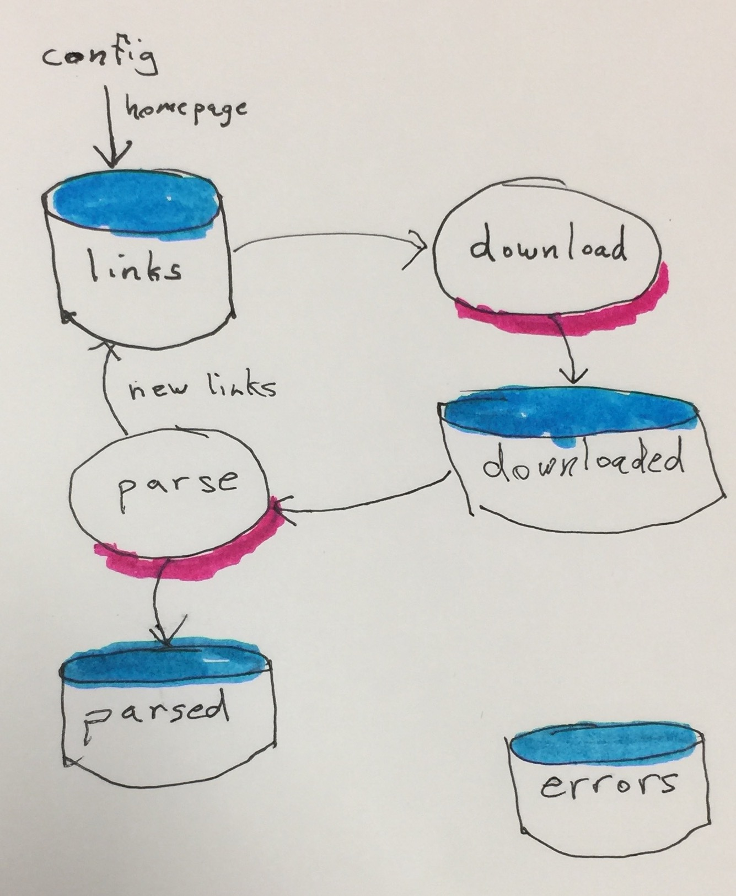

# scraper

This project scrapes websites.



The data for this project is stored in elasticsearch. There are four
types (tables in sql-speak). Each of these contain maps
(hashes/dictionaries/documents). They are links (containing urls),
downloaded (web pages that have been scraped), parsed (data extracted,
usually from the leaf pages).

There are two independent processes. The first looks for any link
documents with a state of _new_, and downloads the url and stores
it in the downloaded type. The secon process looks for any downloaded
documents with a state of _new_, and parses it.

Most of the code is general and will work for any site. There is a seed
map fed into the scraping process that contains a few vital pieces of info.
The map should contain the name of the website, which it will use as
the index name. The map may also contain a version (which gets appended to
the index name) and environment (which gets prepended). The map also
has a reference to two functions: one to gather new links from a downloaded
document, and the other to gather parsed information (such as description,
price, etc.) to save into the parsed type.

A document is stored in the error type upon an error from either of these
processes.

### Website configuration

The following is an example configuration for scraping a website.

```clojure
{:name "amazing-site"               ;; will be used as the index name
 :base-url "https://www.amazing-site.com"
 :start-path "/product-categories"  ;; initial page to parse
 :gather-links-fn #'gather-links    ;; function to be called for extracting links
 :gather-info-fn #'gather-info      ;; function to be called for extracting information
 }
```

### Document structure

Each document will contain minimally the following:

```clojure
{:path "the url path of the document (sans the scheme and host)"
 :state "state of this link/downloaded/parsed document. Common states are new, processed, and error."
 :state-updated-on "automatically updated each time the state is updated."
 }
```

Link documents typically contain a :title as well.

Downloaded documents contain all the normal http response fields in addition to the above
(:status, :body, etc.)

Parsed documents supplement the above fields with the extracted data.

## Installation

Download from http://example.com/FIXME.

## Usage

    $ java -jar plain-scrape-0.1.0-standalone.jar [args]

## License

Copyright © 2016 FIXME

Distributed under the Eclipse Public License either version 1.0 or (at
your option) any later version.
